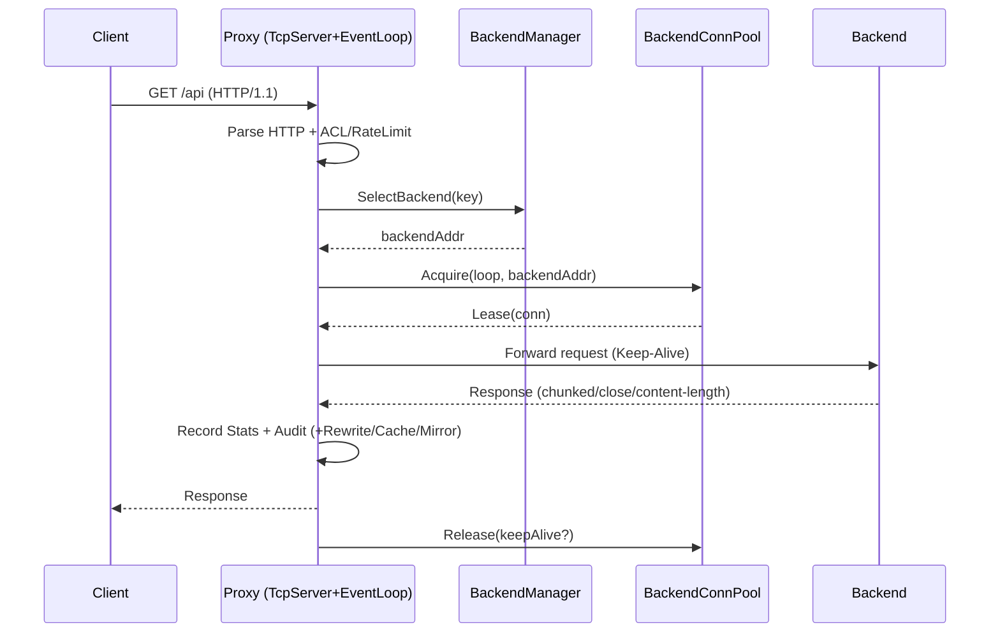
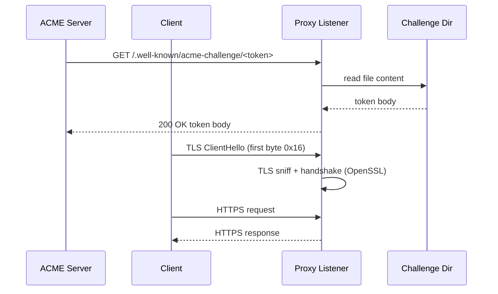

# 系统架构设计说明（Architecture）

本文档给出生产级架构视角的：组件图 / 数据流图 / 关键序列图。

## 1. 设计目标与约束

- 高并发：10K+ 连接（TCP/UDP），低延迟（内网 P99 < 10ms 的目标）。
- AI 场景：模型/版本路由、GPU/队列指标驱动的调度与健康检查。
- 多协议：HTTP/1.1、HTTP/2(h2c)、gRPC、WebSocket、Raw TCP/UDP。
- 可观测：`/stats`、历史采样 `/history`、告警系统、多维限流/ACL/审计日志。
- 依赖最小化：核心以 C++ 自研为主，外部依赖尽量少（少量使用 OpenSSL/Zlib/liburing）。

## 2. 组件图（Component Diagram）

```mermaid
flowchart LR
  Client[Client: HTTP/gRPC/WS/TCP/UDP] -->|TCP/UDP| Listener[Listener: TcpServer / UdpProxyServer]
  Listener --> Reactor[EventLoop + Poller(epoll/poll/select/io_uring)]

  Reactor --> L4[L4 Proxy Session]
  Reactor --> L7[L7 HTTP/HTTP2/gRPC/WebSocket]

  subgraph ControlPlane[Control Plane]
    CFG[Config INI + Web Config UI] -->|load/save| CONF[Config::Instance]
    DIAG[Diagnostics UI] -->|/admin/diagnose| STATS[Stats + History]
    CAC[Config-as-code API] -->|GET/POST /admin/config?format=ini| CONF
  end

  subgraph Extensibility[Extensibility]
    PM[PluginManager (dlopen .so)] --> PLUGS[(Plugins)]
  end

  subgraph Balancing[Balancing]
    BM[BackendManager] --> ALG[Balancer: RR / LeastConn / ConsistentHash / RTW / GPU / LeastQueue]
    BM --> HC[HealthCheck: TCP/HTTP/AI/Script]
    BM --> SD[ServiceDiscovery: static + HTTP register]
  end

  subgraph Security[Security & Safety]
    ACL[AccessControl] --> L7
    RL[RateLimit: global/per-ip/per-path] --> L7
    DDoS[DDoS Accept Limiter] --> Listener
    AUDIT[AuditLogger] --> L7
    TLS[TLS termination + ACME HTTP-01] --> Listener
  end

  subgraph Observability[Observability]
    STATS --> DASH[/dashboard]
    STATS --> HIST[/history]
    ALERT[AlertManager] --> STATS
  end

  L4 --> BM --> Backends[(Backends: AI services)]
  L7 --> BM --> Backends
  L7 --> PM
```

## 3. 数据流图（Data Flow）

```mermaid
flowchart TD
  A[Client Request] --> B[TcpServer accept / Udp recv]
  B --> C[EventLoop dispatch]
  C --> D{Protocol detect}
  D -->|HTTP/1.1| E[HttpContext parse]
  D -->|HTTP/2(h2c)| F[Http2Connection]
  D -->|WebSocket| G[Upgrade + Tunnel]
  D -->|Raw TCP| H[L4 Tunnel]
  D -->|UDP| U[UdpProxyServer session]

  E --> S1[Security: ACL + RateLimit]
  F --> S1
  G --> S1
  H --> S1

  S1 --> LB[Backend select (BackendManager)]
  LB --> POOL[BackendConnectionPool acquire]
  POOL --> IO[Forward bytes / stream / rewrite]
  IO --> R[Response to client]

  IO --> M[Stats + Audit + Mirror + Cache]
  M --> R
```

## 4. 关键序列图（Sequence Diagram）

### 4.1 HTTP/1.1 代理转发（含连接池）



### 4.2 TLS + ACME HTTP-01（同端口嗅探）



## 5. 线程模型与扩展

- One Loop Per Thread：`EventLoopThreadPool` 支持多 Reactor 线程。
- `SO_REUSEPORT`：可启动多个进程/实例实现水平扩展（无共享）。

## 6. 关键模块映射

- 网络引擎：`include/proxy/network/*`, `src/network/*`
- 协议处理：`include/proxy/protocol/*`, `src/protocol/*`
- 负载均衡：`include/proxy/balancer/*`, `src/balancer/*`
- 监控安全：`include/proxy/monitor/*`, `src/monitor/*`
- 主入口：`src/main.cpp`，代理核心：`src/ProxyServer.cpp`
